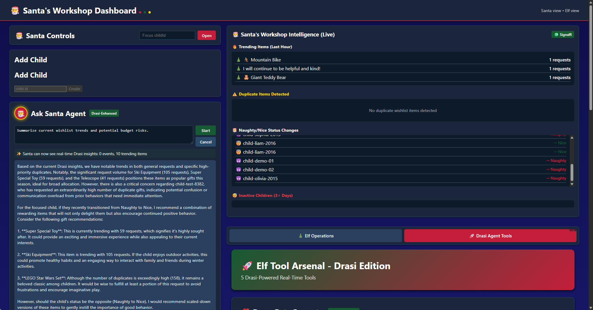

# Santa's Digital Showcase 🎅

> **A demonstration of real-time event-driven AI agent orchestration using Drasi, Microsoft Agent Framework, and Azure**

> 🎄 **Part of [Festive Tech Calendar 2025](https://festivetechcalendar.com/)** - Supporting [Beatson Cancer Charity](https://www.beatsoncancercharity.org/) 🎗️

This solution Showcase an intelligent gift recommendation and logistics system for Santa's Workshop, combining event-driven architecture with multi-agent AI orchestration. It demonstrates how to build scalable, real-time AI applications using Azure services, Drasi event processing, and the Microsoft Agent Framework.

---

## 🎯 Solution Overview

Santa's Digital Workshop is a cloud-native application that processes children's wishlists in real-time, generates personalized gift recommendations, and performs logistics assessments using coordinated AI agents. The system demonstrates:

- **Event-Driven Architecture**: Real-time wishlist and profile updates via Azure EventHub and Cosmos DB Change Feed
- **Multi-Agent AI Orchestration**: Specialized AI agents working together using Microsoft Agent Framework
- **Graph-Based Event Processing**: Drasi continuous queries for intelligent event routing and transformation
- **Streaming AI Responses**: Server-Sent Events (SSE) for live agent reasoning and updates
- **Enterprise-Grade Infrastructure**: Azure Container Apps, AKS, Cosmos DB, and Azure OpenAI

### Key Features

✅ **Real-Time Wishlist Processing** - Children's wishlists trigger immediate AI agent workflows
✅ **Intelligent Recommendations** - AI agents analyze preferences, age, budget, and behavior
✅ **Logistics Assessment** - Automated feasibility checks for delivery, inventory, and regional constraints
✅ **Behavior Tracking** - Naughty/Nice event processing with reputation scoring
✅ **Live Updates** - SignalR and SSE for streaming agent activity to the frontend
✅ **Event Graph Processing** - Drasi debouncing, deduplication, and intelligent routing
✅ **Comprehensive Testing** - Interactive demo scripts and automated smoke tests

## 

## 🏗️ Architecture

### High-Level Architecture

```
┌─────────────────────────────────────────────────────────────────┐
│                         Frontend (React + Vite)                  │
│                  Azure Static Web App / Container App            │
└─────────────┬───────────────────────────────────────────────────┘
              │ HTTPS / SignalR / SSE
┌─────────────▼───────────────────────────────────────────────────┐
│                   API (.NET 9 / ASP.NET Core)                    │
│                      Azure Container App                         │
│  ┌──────────────────────────────────────────────────────────┐  │
│  │  Multi-Agent Orchestrator (Microsoft Agent Framework)    │  │
│  │  - Profile Agent      - Recommendation Agent             │  │
│  │  - Logistics Agent    - Behavior Tracking Agent          │  │
│  └──────────────────────────────────────────────────────────┘  │
└─────────────┬───────────────────────────────────────────────────┘
              │
    ┌─────────┼─────────┬──────────────┬────────────────┐
    │         │         │              │                │
┌───▼──┐  ┌──▼──┐  ┌───▼────┐  ┌─────▼──────┐  ┌─────▼─────┐
│Cosmos│  │Event│  │ Drasi  │  │   Azure    │  │    Key    │
│  DB  │  │ Hub │  │  (AKS) │  │   OpenAI   │  │   Vault   │
└──────┘  └─────┘  └────────┘  └────────────┘  └───────────┘
```

### Drasi Event Processing Pipeline

```
EventHub (Wishlists) ──┐
                       │
Cosmos Change Feed ────┼──► Debounce ──► Dedupe ──► Orchestrator API
(Profiles)             │                              (Agent Triggers)
                       │
                       └──► Dead Letter Queue (Cosmos)
```

### Data Flow

1. **Wishlist Submission**: Frontend → API → EventHub → Drasi
2. **Profile Update**: API → Cosmos DB → Change Feed → Drasi
3. **Event Processing**: Drasi applies debouncing/deduplication → Routes to Orchestrator API
4. **Agent Orchestration**: Orchestrator coordinates Profile → Recommendation → Logistics agents
5. **Real-Time Updates**: Agents stream reasoning via SSE → Frontend displays live progress
6. **Result Storage**: Recommendations/Assessments → Cosmos DB → SignalR broadcast to clients

---

## 🧩 Components

### 1. Frontend (`/frontend`)

- **Technology**: React 18, TypeScript, Vite
- **Features**: Child profiles, wishlist submission, live agent activity streaming, SignalR integration
- **Deployment**: Azure Static Web Apps or Container Apps (same-origin with API)

### 2. Backend API (`/src`)

- **Technology**: .NET 9, ASP.NET Core, C#
- **Key Services**:
  - `MultiAgentOrchestrator` - Coordinates agent workflows
  - `ElfAgentOrchestrator` - Manages specialized elf agents (Profile, Recommendation, Logistics)
  - `DrasiViewClient` - Queries Drasi continuous query results
  - `StreamingAgentService` - SSE streaming for live agent responses
  - `EventHubPublisher` - Publishes wishlist events
- **Deployment**: Azure Container Apps with managed identity

### 3. AI Agents (`/src/services`)

Built using **Microsoft Agent Framework** with Azure OpenAI:

| Agent                    | Purpose                                                                              | Key Tools                                |
| ------------------------ | ------------------------------------------------------------------------------------ | ---------------------------------------- |
| **Profile Agent**        | Consolidates child profiles from wishlist data, behavior events, and metadata        | Cosmos DB queries, preference extraction |
| **Recommendation Agent** | Generates age-appropriate gift suggestions based on profile, budget, and preferences | Inventory checks, pricing tools          |
| **Logistics Agent**      | Assesses delivery feasibility, stock availability, lead times                        | Regional constraints, availability tools |
| **Behavior Tracking**    | Processes Naughty/Nice events and updates reputation scores                          | Event aggregation, scoring rules         |

### 4. Drasi Event Processing (`/drasi`)

- **Platform**: Kubernetes (AKS) with Dapr runtime
- **Sources**: Azure EventHub (wishlists), Cosmos DB Change Feed (profiles)
- **Processors**: Debouncing (5s window), Deduplication (childId + hash)
- **Sinks**: Orchestrator API (HTTP POST), Dead Letter Queue (Cosmos)
- **Continuous Queries**: Graph-based event transformations and intelligent routing

### 5. Infrastructure (`/infra`)

- **IaC**: Bicep templates for Azure resources
- **Resources**:
  - Azure Container Apps (API + Frontend)
  - Azure Kubernetes Service (Drasi platform)
  - Azure Cosmos DB (profiles, wishlists, recommendations, jobs)
  - Azure EventHub (event ingestion)
  - Azure OpenAI (GPT-4 for agents)
  - Azure Key Vault (secrets management)
  - Log Analytics (observability)

---

## 🚀 Getting Started

### Prerequisites

- **Azure Subscription** with permissions to create resources
- **Azure Developer CLI (azd)** - [Install](https://learn.microsoft.com/azure/developer/azure-developer-cli/install-azd?tabs=winget-windows%2Cbrew-mac%2Cscript-linux&pivots=os-windows&WT.mc_id=AZ-MVP-5004796)
- **Docker Desktop** - [Install](https://www.docker.com/products/docker-desktop/)
- **Node.js 18+** - [Install](https://nodejs.org/)
- **.NET 9 SDK** - [Install](https://dotnet.microsoft.com/download/dotnet/9.0?WT.mc_id=AZ-MVP-5004796)
- **PowerShell 7+** - [Install](https://learn.microsoft.com/powershell/scripting/install/install-powershell?view=powershell-7.5&WT.mc_id=AZ-MVP-5004796)
- **kubectl** - [Install](https://kubernetes.io/docs/tasks/tools/)
- **Drasi CLI** - [Install](https://drasi.io/docs/)

### Quick Start

```powershell
# 1. Clone the repository
git clone https://github.com/lukemurraynz/SantaDigitalWorkshop25.git
cd SantaDigitalWorkshop25

# 2. Initialize azd environment
azd auth login
azd init

# 3. Provision Azure infrastructure (creates AKS, Cosmos DB, EventHub, Container Apps, etc.)
azd provision

# 4. Deploy Drasi on AKS
cd drasi
.\install-drasi.ps1
.\apply-drasi-resources.ps1

# 5. Deploy API and Frontend
azd deploy

# 6. Run interactive demo
cd ../scripts
.\demo-interactive.ps1
```

### Deployment Steps (Detailed)

#### Step 1: Provision Infrastructure

```powershell
# This creates all Azure resources via Bicep templates
azd provision
```

**What gets created:**

- Resource Group
- Azure Kubernetes Service (AKS) cluster
- Azure Cosmos DB account with databases/containers
- Azure EventHub namespace with `wishlist-events` hub
- Azure Container Apps environment
- Azure OpenAI account with GPT-4 deployment
- Azure Key Vault for secrets
- Log Analytics workspace
- Managed identities and role assignments

#### Step 2: Deploy Drasi

```powershell
cd drasi

# Install Drasi platform on AKS
.\install-drasi.ps1

# Apply Drasi resources (sources, processors, sinks, continuous queries)
.\apply-drasi-resources.ps1
```

**Drasi Components:**

- EventHub source for wishlist events
- Cosmos DB Change Feed source for profile updates
- Debounce processor (5-second window by childId)
- Deduplication processor (childId + hash)
- HTTP sink to Orchestrator API
- Dead letter queue for failed events

#### Step 3: Deploy Application

```powershell
# Deploy API to Container Apps
azd deploy api

# Deploy Frontend to Static Web App or Container Apps
azd deploy frontend
```

#### Step 4: Verify Deployment

```powershell
cd scripts
.\test-demo-readiness.ps1
```

---

## 🎮 Running Demos

### Interactive Demo Script

The primary demo interface with 7 scenarios:

```powershell
cd scripts
.\demo-interactive.ps1
```

**Available Scenarios:**

1. **Wishlist Processing** - Submit wishlist → Profile analysis → Recommendations
2. **Multi-Agent Workflow** - Watch agents collaborate in real-time
3. **Logistics Assessment** - Evaluate delivery feasibility for recommendations
4. **Naughty/Nice Events** - Process behavior events and update reputation
5. **Streaming Recommendations** - Live SSE updates from AI agents
6. **Agent Tools Showcase** - Demonstrate tool calling and function execution
7. **Full System Validation** - End-to-end health check

### Smoke Tests (CI/CD)

```powershell
.\test-smoke.ps1 -ApiUrl "https://your-api.azurecontainerapps.io" -FrontendUrl "https://your-frontend.app"
```

### Manual EventHub Testing

```powershell
.\send-wishlist-event.ps1 -ChildId "child-123" -Items "LEGO Set:1,Science Kit:1" -Hub "wishlist-events"
```

---

## 📁 Project Structure

```
.
├── src/                          # Backend API (.NET 9)
│   ├── Program.cs               # API startup and configuration
│   ├── services/                # Business logic and agents
│   │   ├── MultiAgentOrchestrator.cs
│   │   ├── ElfAgents.cs         # Specialized elf AI agents
│   │   ├── StreamingAgentService.cs
│   │   └── DrasiViewClient.cs
│   ├── models/                  # Domain models
│   └── Middleware/              # Custom middleware
├── frontend/                     # React + TypeScript frontend
│   ├── src/
│   │   ├── components/
│   │   ├── hooks/
│   │   └── services/
│   └── AGUI_INTEGRATION_DESIGN.md
├── drasi/                        # Drasi configuration
│   ├── graph.yaml               # Event processing graph
│   ├── install-drasi.ps1
│   ├── apply-drasi-resources.ps1
│   ├── sources/                 # Source definitions
│   ├── resources/               # Continuous queries
│   └── manifests/               # Kubernetes manifests
├── infra/                        # Bicep infrastructure
│   ├── main.bicep
│   ├── modules/
│   └── cosmos/
├── scripts/                      # Operational scripts
│   ├── demo-interactive.ps1     # Primary demo interface
│   ├── test-demo-readiness.ps1
│   ├── test-smoke.ps1
│   └── send-wishlist-event.ps1
├── tests/                        # Unit and integration tests
├── docs/                         # Documentation
└── azure.yaml                    # Azure Developer CLI config
```

---

## 🔧 Configuration

### Environment Variables

Key environment variables for local development (create `.env` in repo root):

```bash
# Azure OpenAI
AZURE_OPENAI_ENDPOINT=https://your-openai.openai.azure.com/
AZURE_OPENAI_KEY=your-key-here
AZURE_OPENAI_DEPLOYMENT_NAME=gpt-4

# Cosmos DB
COSMOS_ENDPOINT=https://your-cosmos.documents.azure.com:443/
COSMOS_KEY=your-key-here
COSMOS_DATABASE=santaworkshop

# EventHub
EVENTHUB_NAMESPACE=your-eventhub-ns
EVENTHUB_CONNECTION_STRING=Endpoint=sb://...

# Drasi
DRASI_VIEW_SERVICE_URL=http://your-drasi-view-service
DRASI_SIGNALR_URL=http://your-drasi-signalr

# Optional: Agent Configuration
AGENT_TRIGGER_SECRET=your-secret-here
```

### Managed Identity (Production)

In production, the solution uses **Azure Managed Identity** for authentication:

- Container Apps → Cosmos DB, EventHub, Key Vault, Azure OpenAI
- AKS workloads → EventHub, Cosmos DB (Drasi sources)

No keys or connection strings required when properly configured.

---

## 🧪 Testing

### Unit Tests

```powershell
cd tests
dotnet test
```

### Integration Tests

```powershell
cd tests/integration
dotnet test
```

### Contract Tests

```powershell
cd tests/contract
dotnet test
```

---

## 📊 Observability

### Application Insights

- Distributed tracing across API, agents, and Drasi
- Custom metrics for agent executions, event processing
- Performance monitoring and anomaly detection

### Log Analytics

- Centralized logging from Container Apps and AKS
- Drasi component logs (sources, processors, sinks)
- Query using Kusto (KQL)

### Health Checks

```bash
# API health
curl https://your-api.azurecontainerapps.io/health

# Drasi health (via API)
curl https://your-api.azurecontainerapps.io/api/drasi/health
```

---

## 🐛 Troubleshooting

### Common Issues

| Issue                                             | Solution                                                                    |
| ------------------------------------------------- | --------------------------------------------------------------------------- |
| Drasi continuous queries in `TerminalError` state | Run `.\apply-drasi-resources.ps1` to apply workarounds                      |
| Agent runs timeout or fail                        | Check Azure OpenAI quota and deployment status                              |
| EventHub authentication errors                    | Verify managed identity role assignments                                    |
| Frontend can't connect to SignalR                 | Ensure `VITE_SIGNALR_URL` is empty for same-origin Container App deployment |

### Detailed Troubleshooting Guides

- [Drasi Troubleshooting](./drasi/TROUBLESHOOTING.md) - EventHub sources, continuous queries, proxy services
- [Container App Deployment](./docs/container-app-deployment-guide.md) - Container Apps configuration
- [DRASI-TROUBLESHOOTING.md](./docs/DRASI-TROUBLESHOOTING.md) - Drasi-specific diagnostics

### Logs Access

```powershell
# Container Apps logs
az containerapp logs show -n your-api-app -g your-rg --follow

# AKS/Drasi logs
kubectl logs -n drasi-system deployment/wishlist-eh-reactivator --tail=50

# EventHub metrics
az eventhubs eventhub show --name wishlist-events --namespace-name your-ns --resource-group your-rg
```

---

## 🤝 Contributing

This is a demonstration project. For questions or feedback:

1. Open an issue on GitHub
2. Review the [ISE Engineering Playbook](https://microsoft.github.io/code-with-engineering-playbook/)
3. Check `/scripts/README.md` for operational guidelines

---

## 📚 Documentation

- [Azure Developer CLI](https://learn.microsoft.com/azure/developer/azure-developer-cli/)
- [Microsoft Agent Framework](https://learn.microsoft.com/azure/ai-services/agents/)
- [Drasi Documentation](https://drasi.io/docs/)
- [Azure Container Apps](https://learn.microsoft.com/azure/container-apps/)
- [Azure Cosmos DB](https://learn.microsoft.com/azure/cosmos-db/)
- [Azure OpenAI Service](https://learn.microsoft.com/azure/ai-services/openai/)

---

## 📝 License

This project is provided as-is for demonstration purposes.

---

## 🎄 About

**Santa's Digital Workshop** demonstrates modern cloud-native AI application patterns:

- Event-driven microservices architecture
- Multi-agent AI orchestration with Microsoft Agent Framework
- Real-time stream processing with Drasi
- Enterprise Azure best practices (managed identity, Key Vault, observability)
- Infrastructure as Code with Bicep
- Developer experience with Azure Developer CLI

Built with ❤️ for demonstrating Azure AI and event-driven architectures.
